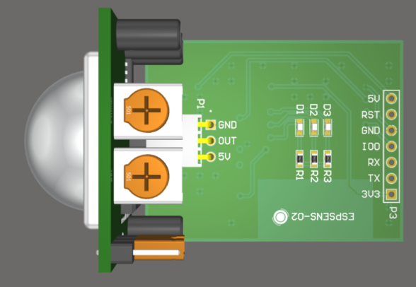
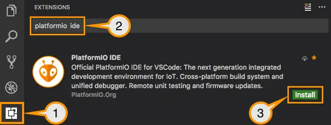
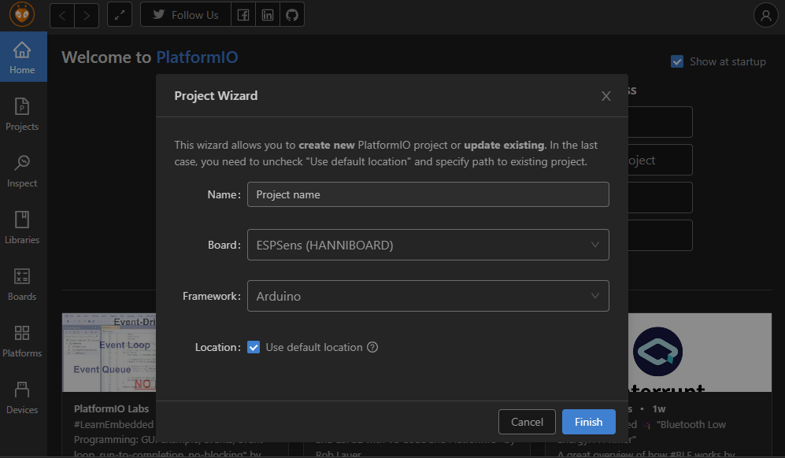
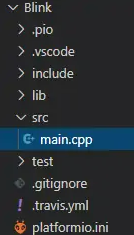

# ESP-PIR Motion Detection Module



An ESP8266-based module with integrated PIR motion sensor and WiFi capabilities. Ideal for IoT security, home automation, and motion-activated projects.

## 📦 Hardware Features

- **ESP8266** (ESP-12F) WiFi microcontroller
- **HC-SR501** PIR motion sensor (or compatible)
- **On-board LED** for visual feedback
- **GPIO breakout** for expansion
- **5V/3.3V** compatible power input

## 🚀 Quick Start Guide

### 1. Hardware Setup

| ESP-PIR Pin | Connection |
| ----------- | ---------- |
| `PIR_OUT`   | GPIO13     |
| `LED_GREEN` | GPIO12     |
| `LED_BLUE`  | GPIO14     |
| `LED_RED`   | GPIO16     |
| `VCC`       | 5V         |
| `GND`       | Ground     |

### 2. Programming Setup

#### 2.1 Using USB-to-Serial Programmer (FTDI/CP2102)
For initial programming or recovery, connect as follows:

| ESP-PIR Pin | Programmer Pin |
|-------------|----------------|
| **5V**      | 5V (or 3.3V if your programmer supports it) |
| **GND**     | GND            |
| **TX**      | RX             |
| **RX**      | TX             |
| **IO0**     | GND (for flash mode) |
| **RST**     | Connect to button for reset |

**Programming Steps:**
1. Connect all wires as shown above
2. Hold down the **RST** button
3. While holding RST, connect **IO0** to GND
4. Release RST (module is now in flash mode)
5. Upload your program
6. Disconnect IO0 from GND and reset to run normally

### 2. Software Setup

#### 2.1 Install PlatformIO

1. Download [Visual Studio Code](https://code.visualstudio.com/)
2. Install the PlatformIO IDE extension



#### 2.2 Create New Project

1. Open PIO Home tab
2. Click "New Project"

  
3. Configure settings:

- Board: `ESPSens(HANNIBOARD)`
- Framework: `Arduino`



1. Click "Finish"

#### 2.3 Project Structure

PlatformIO generates this structure:



---

### 3. Example Code

Open `src/main.cpp` and replace the contents with:

```cpp
#include <Arduino.h>

// Pin definitions
const int pirPin = 13;  // PIR sensor input
const int ledPin = 16;  // LED output (optional)

void setup() {
  pinMode(pirPin, INPUT);
  pinMode(ledPin, OUTPUT);
  Serial.begin(115200);
  Serial.println("ESP-PIR Module Initialized");
}

void loop() {
  int pirState = digitalRead(pirPin);

  if (pirState == HIGH) {
    digitalWrite(ledPin, HIGH);
    Serial.println("Motion detected!");
    delay(1000);  // Debounce delay
  } else {
    digitalWrite(ledPin, LOW);
  }
}
```
